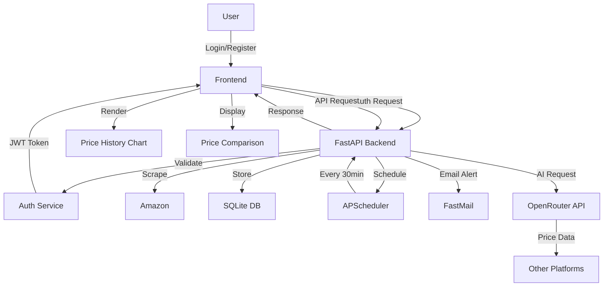
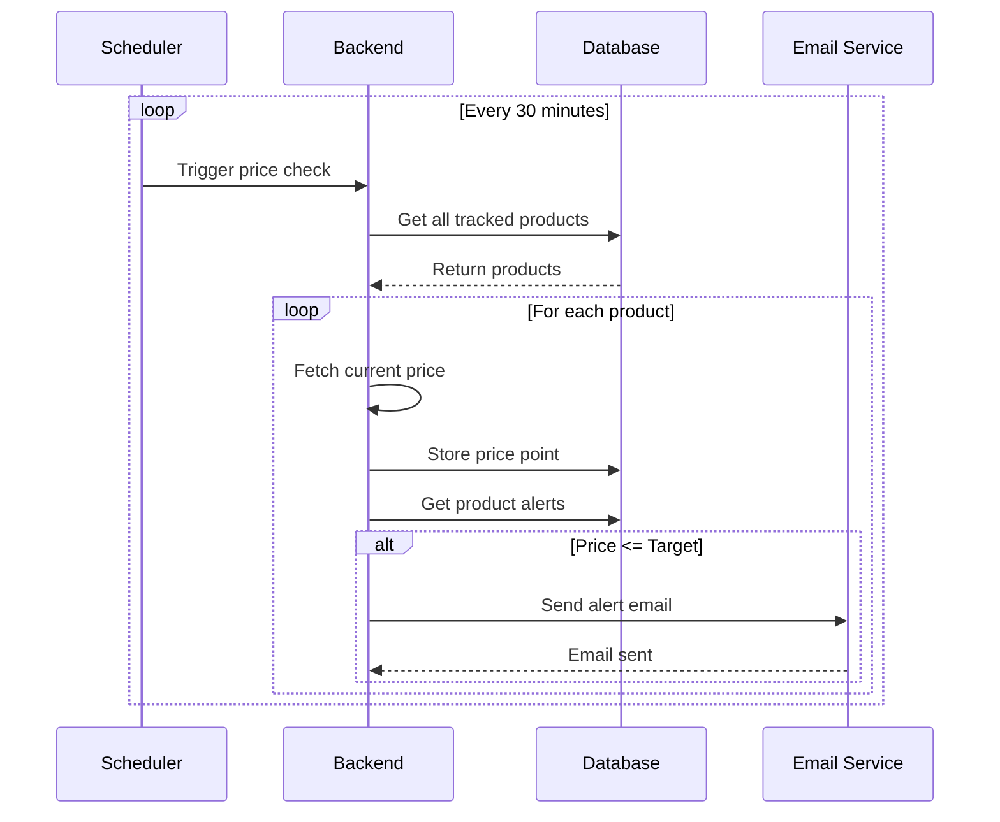
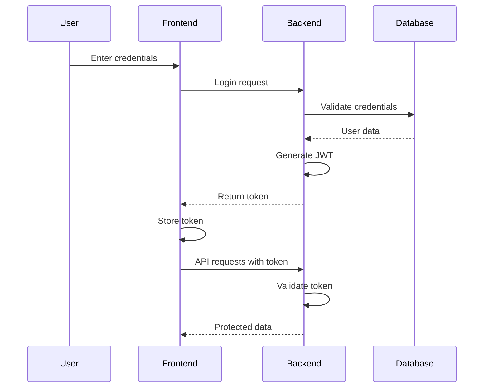

# PricePulse System Architecture

## System Overview



## Component Details

### 1. Frontend (React + TypeScript)

- **Authentication Components**

  - Login form
  - Registration form
  - Protected routes
  - JWT token management

- **Dashboard Component**

  - User's tracked products list
  - Quick price overview
  - Add new product form

- **Product Tracking Component**
  - Product details display
  - Price history chart (48 points/day)
  - Price alerts management
  - Cross-platform comparison

### 2. Backend (FastAPI)

- **Authentication Routes**

  ```
  /auth
  ├── POST /register: Create new user
  ├── POST /login: User authentication
  └── GET /me: Get user profile
  ```

- **Product Management Routes**

  ```
  /products
  ├── GET /: List user's products
  ├── POST /: Add new product
  ├── GET /{id}: Get product details
  ├── GET /{id}/history: Get price history
  └── DELETE /{id}: Remove product
  ```

- **Continuous Tracking Service**
  - APScheduler configuration
  - 30-minute intervals
  - Price update triggers
  - Data point collection

### 3. Database Schema

```sql
-- Users Table
CREATE TABLE users (
    id INTEGER PRIMARY KEY,
    email TEXT UNIQUE,
    password_hash TEXT,
    created_at TIMESTAMP
);

-- Products Table
CREATE TABLE products (
    id INTEGER PRIMARY KEY,
    user_id INTEGER,
    amazon_id TEXT,
    name TEXT,
    current_price REAL,
    image_url TEXT,
    created_at TIMESTAMP,
    FOREIGN KEY (user_id) REFERENCES users(id),
    UNIQUE(user_id, amazon_id)
);

-- Price History Table
CREATE TABLE price_history (
    id INTEGER PRIMARY KEY,
    product_id INTEGER,
    price REAL,
    timestamp TIMESTAMP,
    FOREIGN KEY (product_id) REFERENCES products(id)
);

-- Alerts Table
CREATE TABLE alerts (
    id INTEGER PRIMARY KEY,
    user_id INTEGER,
    product_id INTEGER,
    email TEXT,
    target_price REAL,
    created_at TIMESTAMP,
    FOREIGN KEY (user_id) REFERENCES users(id),
    FOREIGN KEY (product_id) REFERENCES products(id)
);
```

### 4. Continuous Price Tracking Flow



### 5. User Authentication Flow



## Data Flow

1. **User Authentication**

   - User registers/logs in
   - JWT token generated
   - Token used for subsequent requests

2. **Product Tracking**

   - User adds product to track
   - System starts 30-minute monitoring
   - Price history collected continuously
   - 48 data points per day stored

3. **Price Monitoring**

   - Scheduler triggers every 30 minutes
   - All tracked products updated
   - Price history maintained
   - Alerts triggered if needed

4. **Data Visualization**
   - Frontend requests price history
   - Backend returns 48 daily points
   - Chart.js renders interactive graph
   - User can view trends over time

## Security Considerations

1. **Authentication Security**

   - JWT token encryption
   - Password hashing
   - Token expiration
   - Secure cookie storage

2. **API Security**

   - Rate limiting
   - Input validation
   - CORS configuration
   - Request authentication

3. **Data Protection**

   - Email encryption
   - Secure storage
   - API key management
   - User data isolation

4. **Error Handling**
   - Graceful degradation
   - Retry mechanisms
   - User feedback
   - Error logging
